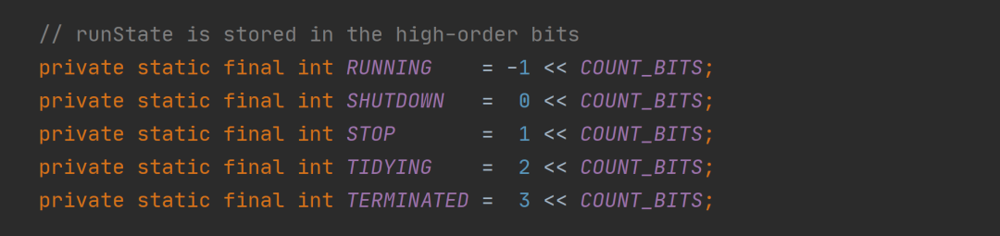
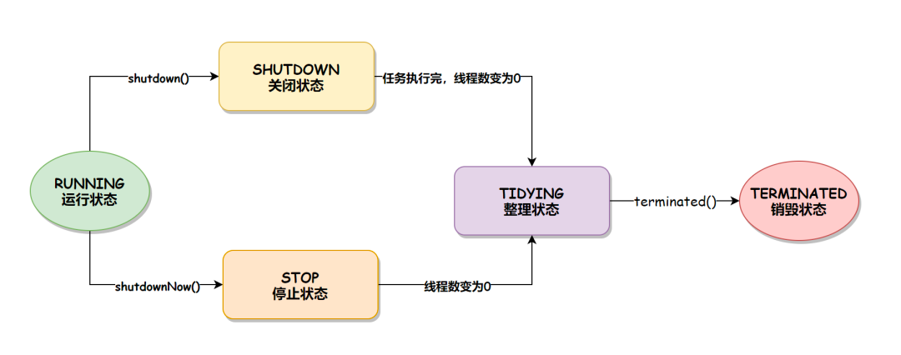
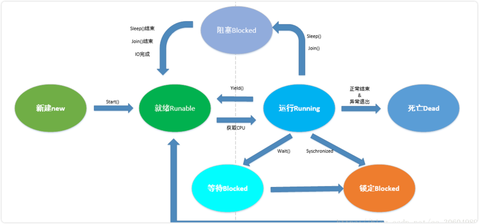
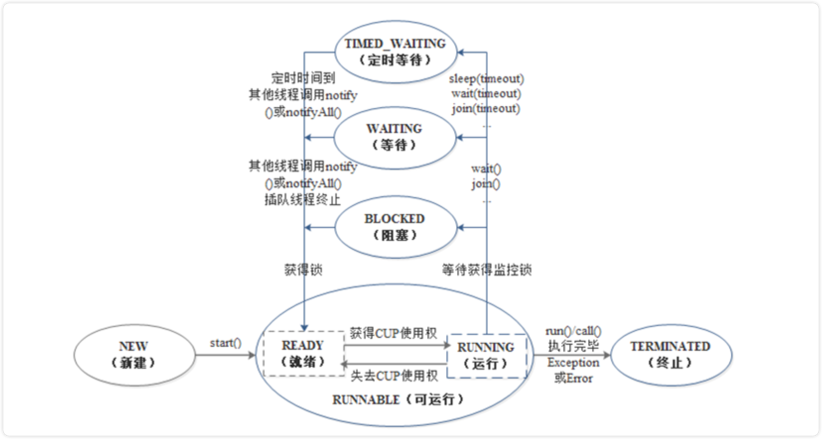

# 线程池的几种状态及变化？操作系统和Java中线程的几种状态及变化？

## 1. 线程池

### 线程池状态
线程池的状态有以下 `5` 种：

- RUNNING：运行状态，线程池创建好之后就会进入此状态，如果不手动调用关闭方法，那么线程池在整个程序运行期间都是此状态。
- SHUTDOWN：关闭状态，不再接受新任务提交，但是会**将已保存在任务队列中的任务处理完**。
- STOP：停止状态，不再接受新任务提交，并且会中断当前正在执行的任务、放弃任务队列中已有的任务。
- TIDYING：整理状态，所有的任务都执行完毕后(也包括任务队列中的任务执行完)，当前线程池中的活动线程数降为 0 时的状态。到此状态之后，会调用线程池的 terminated() 方法。
- TERMINATED：销毁状态，当执行完线程池的 terminated() 方法之后就会变为此状态。

这 5 种状态可以在 ThreadPoolExecutor 源码中找到，如下图所示：

### 线程池状态转移
线程池的状态转移有两条路径：

- 当调用 shutdown() 方法时，线程池的状态会从 RUNNING 到 SHUTDOWN，再到 TIDYING，最后到 TERMENATED 销毁状态。
- 当调用 shutdownNow() 方法时，线程池的状态会从 RUNNING 到 STOP，再到 TIDYING，最后到 TERMENATED 销毁状态。

- 线程状态转换的流程如下图所示：

## 2. 线程

线程状态，操作系统中我们提到的线程有 `5` 种状态，而Java里的线程有 `6` 中状态

### 操作系统中线程的状态

1、**新建（new）**：线程对象被创建后就进入了新建状态。如：Thread thread = new Thread();

2、**就绪状态（Runnable）**：也被称为“可执行状态”。线程对象被创建后，其他线程调用了该对象的start()方法，从而启动该线程。如：thread.start(); 处于就绪状态的线程随时可能被CPU调度执行。

3、**运行状态（Running）**：线程获取CPU权限进行执行。需要注意的是，线程只能从就绪状态进入到运行状态。

4、**阻塞状态（Blocked）**：阻塞状态是线程因为某种原因放弃CPU使用权限，暂时停止运行。直到线程进入就绪状态，才有机会进入运行状态。阻塞的三种情况：

> 1）等待阻塞：通过调用线程的wait()方法，让线程等待某工作的完成。 
> 2）同步阻塞：线程在获取synchronized同步锁失败（因为锁被其他线程占用），它会进入同步阻塞状态。
> 3）其他阻塞：通过调用线程的sleep()或join()或发出了I/O请求时，线程会进入到阻塞状态。当sleep()状态超时、join()等待线程终止或超时、或者I/O处理完毕时，线程重新转入就绪状态。

5、**死亡状态（Dead）**：线程执行完了或因异常退出了run()方法，该线程结束生命周期。

### Java中线程的状态

Java线程的生命周期分为:

1、NEW（初始化状态）
创建一个线程对象后，该线程对象就处于新建状态，此时它不能运行，和其他Java对象一样，仅仅由JVM为其分配了内存，没有表现出任何线程的动态特征。

2、RUNNABLE（可运行状态/运行状态）

可运行状态包括运行中状态（RUNNING）和就绪状态(READY)
- 就绪状态：线程对象调用start()方法之后，等待JVM的调度，此时线程并没有运行;
- 运行状态：线程对象获得JVM调度，如果存在多个CPU，那么允许多个线程并行运行。

3、BLOCKED（阻塞状态）

处于运行状态的线程可能会因为某些原因失去CPU的执行权，暂时停止运行进入阻塞状态。此时，JVM不会给线程分配CPU，直到线程重新进入就绪状态，才有机会转换到运行状态。阻塞状态的线程只能先进入就绪状态，不能直接进入运行状态。

线程一般会在以下两种情况下进入阻塞状态：
- 当线程A运行过程中，试图获取同步锁时，却被线程B获取，此时JVM把当前线程A存到对象的锁池中，线程A就会进入阻塞状态;
- 当线程运行过程中，发出IO请求时，此时该线程也会进入阻塞状态。

4、WAITING（等待状态）

当处于运行状态的线程调用了无时间参数限制的方法后，如wait()、join()等方法，就会将当前运行中的线程转换为等待状态。
处于等待状态中的线程不能立即争夺CPU使用权，必须等待其他线程执行特定的操作后，才有机会再次争夺CPU使用权，将等待状态的线程转换为运行状态。例如，调用wait()方法而处于等待状态中的线程，必须等待其他线程调用**notify()或者notifyAll()**方法唤醒当前等待中的线程;调用join()方法而处于等待状态中的线程，必须等待其他加入的线程终止。

5、TIMED_WAITING（有时限的等待）

将运行状态中的线程转换为定时等待状态中的线程与转换为等待状态中的线程操作类似，只是运行线程调用了有时间参数限制的方法，如sleep(long millis)、wait(long timeout)、join(long millis)等方法。

处于定时等待状态中的线程也不能立即争夺CPU使用权，必须等待其他相关线程执行完特定的操作或者限时时间结束后，才有机会再次争夺CPU使用权，将定时等待状态的线程转换为运行状态。例如，调用了wait(long timeout) 方法而处于等待状态中的线程，需要通过其他线程调用notify()或者notifyAll()方法唤醒当前等待中的线程，或者等待限时时间结束后也可以进行状态转换。

6、TERMINATED（终止状态）

线程的run()方法、call()方法正常执行完毕或者线程抛出一个未捕获的异常(Exception)、错误(Error)，线程就进入终止状态。一旦进入终止状态，线程将不再拥有运行的资格，也不能再转换到其他状态，生命周期结束。

## 3. 参考

* https://www.51cto.com/article/704618.html
* http://hz.itheima.com/news/20221107/102713.html