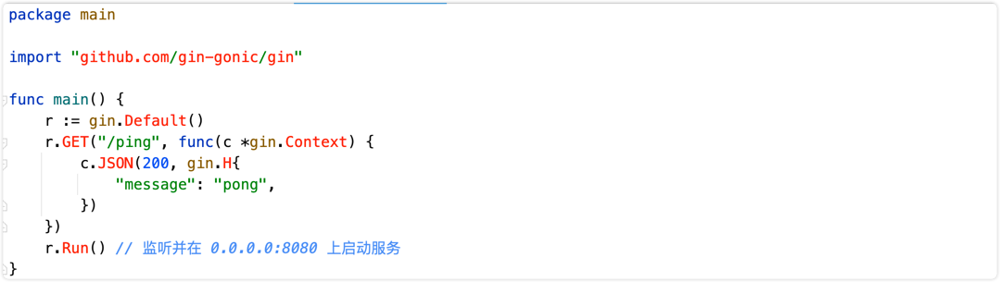
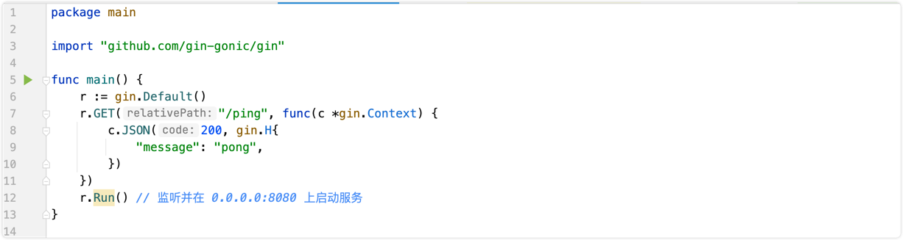
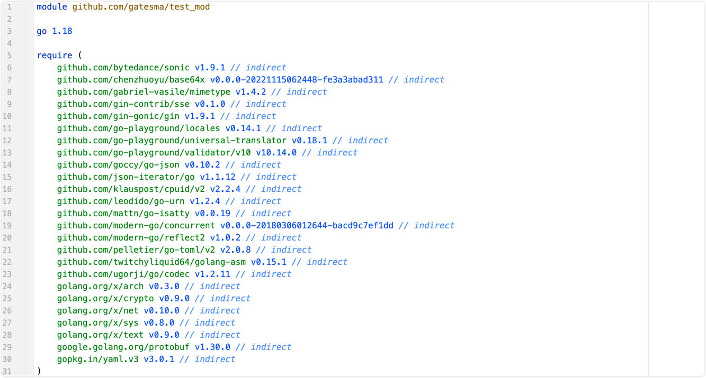

# 1. Golang项目依赖Go modules

## 一、什么是Go Modules?

Go modules 是 Go 语言的依赖解决方案。是 Go 语言 1.11 版本正式推出的，在 1.14 版本时，官方就发话 GoModules 的模拟已经成熟，可以用于生产环境了。

Go moudles 目前集成在 Go 的工具链中，只要安装了 Go，自然而然也就可以使用 Go moudles 了，而 Go modules 的出现也解决了在 Go1.11 前的几个常见争议问题：

* Go 语言长久以来的依赖管理问题。对比Java有maven或者gradle。
* “淘汰”现有的 GOPATH 的使用模式。
* 统一社区中的其它的依赖管理工具（提供迁移功能）。

## 二、GoPath 模式

既然说go mod是为了淘汰原有的 GoPath 模式，那什么是GoPath开发模式？

当你在电脑上安装好 Go 后，在终端执行 `go env`命令，会发现一个 `GOPATH` 的环境变量，它的值是一个目录路径。表示的是 Go 语言的工作目录，这个目录下会有三个子目录，它们分别是：

- src 目录：放置项目和库的源文件；
- pkg 目录：放置编译后生成的包/库的归档文件
- bin 目录：放置编译后生成的可执行文件。

> pkg合src目录其实我也没看出来什么区别，网上看有人说pkg是存放预编译文件.a，但是没找到有.a后缀的文件。。。

而所谓的『GoPath开发模式』就是指将项目文件和下载的包放到 `$GOPATH/src`目录下进行管理的方式。

### GoPath 模式的弊端

在 Go 1.11版本之前，开发者是必须要配置 这个`GOPATH`环境变量的，这种代码代码管理模式存在比较严重的问题就是没有版本控制。

因为多个项目都会放在`src`目录下，而每个项目依赖的一些第三方包也是下载在`src`目录下的，当升级某个依赖包时那就是全局升级了，引用这个依赖包的项目都跟着升级包版本了，这样是一件很危险的事，你不知道升级的包在另外一个项目中是否能正常运行的。而且当多人协同开发时，你不知道别人下载的包是不是你所用的那个版本，容易出错且不好排查原因。

## 三、**Go Modules模式**

使用 GoModules 模式主要依赖于官方发布了自己的包管理工具，即 mod。跟 Java 里的 maven 或者 gradle， node 里的 npm 是类似的工具。

### 1. go mod 常用命令


| 命令                | **作用**                             |
| ------------------- | ------------------------------------ |
| **go mod init**     | **生成 go.mod 文件**                 |
| **go mod download** | **下载 go.mod 文件中指明的所有依赖** |
| **go mod tidy**     | **整理现有的依赖**                   |
| **go mod graph**    | **查看现有的依赖结构**               |
| **go mod edit**     | **编辑 go.mod 文件**                 |
| **go mod vendor**   | **导出项目所有的依赖到vendor目录**   |
| **go mod verify**   | **校验一个模块是否被篡改过**         |
| **go mod why**      | **查看为什么需要依赖某模块**         |

### 2. go mod环境变量

可以通过 go env 命令来进行查看

#### GO111MODULE

当你要使用 GoModules 模式时，你需要主动开启它，在终端输入命令 `go env` 时，你会发现一个 `GO111MODULE` 变量：


它所有可以设置的值有：

1. **auto：** 自动模式，当项目下存在 go.mod 文件时，就启用 GoModules 模式；
2. **on：** 开启模块支持，编译时会忽略 GOPATH 和 vendor 文件夹，只根据 go.mod下载依赖。现在我们开发项目，都是这个模式了
3. **off：** 关闭模块支持，使用 GOPATH 模式。

可以使用这个命令切换成on：`go env -w GO111MODULE=on`

#### GOPROXY

这个环境变量主要是用于设置 Go 模块代理（Go module proxy）,其作用是用于使 Go 在后续拉取模块版本时直接通过镜像站点来快速拉取。

GOPROXY 的默认值是：https://proxy.golang.org,direct

```
proxy.golang.org国内访问不了,需要设置国内的代理.
●  阿里云
https://mirrors.aliyun.com/goproxy/
●  七牛云
https://goproxy.cn,direct 
```

使用以下命令设置代理：`go env -w GOPROXY=https://goproxy.cn,direct`

GOPROXY 的值是一个以英文逗号 “,” 分割的 Go 模块代理列表，允许设置多个模块代理，假设你不想使用，也可以将其设置为 “off” ，这将会禁止 Go 在后续操作中使用任何 Go 模块代理。

> - 刚刚设置的值中, direct的含义？实际上 “direct” 是一个特殊指示符，用于指示 Go 回源到模块版本的源地址去抓取（比如 GitHub 等）
> - 场景如下：当值列表中上一个 Go 模块代理返回 404 或 410 错误时，Go 自动尝试列表中的下一个，遇见 “direct” 时回源，也就是回到源地址去抓取。
> - 源地址什么含义？ 因为go的依赖包版本其实很多都是在github这种版本控制网站上存储的，比如构建web网站时经常用到的gin包： github.com/gin-gonic/gin。其源地址就是github，我们设置的代理，其实就是这里源地址的一份拷贝。

#### GOSUMDB

它的值是一个 Go checksum database，用于在拉取模块版本时（无论是从源站拉取还是通过 Go module proxy 拉取）保证拉取到的模块版本数据未经过篡改，若发现不一致，也就是可能存在篡改，将会立即中止。

GOSUMDB 的默认值为：`sum.golang.org`，在国内也是无法访问的，但是 GOSUMDB 可以被 Go 模块代理所代理（详见：Proxying a Checksum Database）。

因此我们可以通过设置 GOPROXY 来解决，而先前我们所设置的模块代理 `goproxy.cn` 就能支持代理 `sum.golang.org`，所以这一个问题在设置 GOPROXY 后，你可以不需要过度关心。

另外若对 GOSUMDB 的值有自定义需求，其支持如下格式：

* **格式 1：**`<SUMDB_NAME>+<PUBLIC_KEY>`。
* **格式 2：**`<SUMDB_NAME>+<PUBLIC_KEY> <SUMDB_URL>`。

**也可以将其设置为“off”，也就是禁止 Go 在后续操作中校验模块版本。**

#### GONOPROXY/GONOSUMDB/GOPRIVATE

**这三个环境变量都是为了解决项目中用到的包，但是这些包在公共代码仓库里找不到的情况。**

在当前项目依赖了私有模块，例如是公司的私有 git 仓库，属于私有模块，需要进行设置的，否则会拉取失败。

- 比如你们公司的同学开发了一个包，发布到了内网git仓库xxx.git.com里，这个包通过上面设置的GOPROXY，肯定都没用，设置为任何代理都没用，因为根本找不到。所以需要设置`go env -w GOPRIVATE="xxx.git.com"`，表示所有xxx.git.com这个域名的包都不再经过goproxy，而是直接通过内网的代码仓库就下载了
- 一般建议直接设置 GOPRIVATE，它的值将作为 GONOPROXY 和 GONOSUMDB 的默认值，设置了 GOPRIVATE之后其他两个都不用设置了
- 这三个变量它们的值都是一个以英文逗号 “,” 分割的模块路径前缀，也就是可以设置多个

#### GOMODCACHE

这个变量是默认的当我们启用go module时候，我们当前电脑下载的所有的依赖都会缓存在这个目录下，方便你不需要每次构建都再去拉取一次相关的包, 当然我们可以使用
go clean -modcache 这样的命令去清除所有的缓存，不过这个命令慎用，因为清楚缓存后，如果你项目依赖了太多的包，下载需要一段时间。有时候我们往往会遇到
有写开源的作者，对源代码进行了修改，但是版本号没有升级，导致代码的不兼容，而我们本地又缓存了代码，这时候就可以通过清除缓存来解决这个问题。

#### GOBIN

这是在你执行go install github.com/xxx/xxx-project这样的安装第三方库的时候，第三方库默认安装的位置。我们一般会将GOBIN目录添加到环境PATH中去，这样 我们就可以直接在命令行中使用安装的第三方库的命令
**默认不设置也可以，默认安装位置在 GOPATH的bin目录下**

### 3. 使用Go Modules初始化项目

#### 确认开启Go Modules

`go env -w GO111MODULE=on`

直接通过修改系统环境变量也是同样的效果 export GO111MODULE=on

#### 初始化项目

```shell
mkdir test_mod
cd test_mod
go mod init github.com/gatesma/test_mod # 指定这个项目的名称，后续我们将这个工程保存到github上，其他人也可以引用你的包
```

#### 下载依赖

使用如下的main.go文件

```go
//  gin 官网的例子
package main

import "github.com/gin-gonic/gin"

func main() {
	r := gin.Default()
	r.GET("/ping", func(c *gin.Context) {
		c.JSON(200, gin.H{
			"message": "pong",
		})
	})
	r.Run() // 监听并在 0.0.0.0:8080 上启动服务
}
```

现在我们使用到了gin这个外部依赖，如果我们不下载这个依赖的话，肯定是用不了的，而且会提示找不到依赖。


**使用** `go get -u github.com/gin-gonic/gin` **下载依赖**。如果不出意外的话，上面的代码将不再报错。



#### 查看go.mod文件

自动为我们下载了相关依赖和间接依赖



我们来简单看一下这里面的关键字

* module: 用于定义当前项目的模块路径
* go:标识当前Go版本.即初始化版本
* require: 当前项目依赖的一个特定的必须版本
* indirect: 示该模块为间接依赖，也就是在当前应用程序中的 import 语句中，并没有发现这个模块的明确引用，有可能是你先手动 go get 拉取下来的，也有可能是你所依赖的模块所依赖的。(我们可以看到上面我们用go get下载的gin包，也是indirect，虽然我们直接使用了gin。如果我们使用go mod tidy来整理现有依赖的话，就会发现gin包后面的indirect没有了)

#### 查看go.sum文件

在第一次拉取模块依赖后，会发现多出了一个 go.sum 文件，其详细罗列了当前项目直接或间接依赖的所有模块版本，并写明了那些模块版本的 SHA-256 哈希值以备 Go 在今后的操作中保证项目所依赖的那些模块版本不会被篡改。

```
github.com/gin-gonic/gin v1.9.1 h1:4idEAncQnU5cB7BeOkPtxjfCSye0AAm1R0RVIqJ+Jmg=
github.com/gin-gonic/gin v1.9.1/go.mod h1:hPrL7YrpYKXt5YId3A/Tnip5kqbEAP+KLuI3SUcPTeU=
```

我们可以看到一个模块路径可能有如下两种：
h1:hash情况
go.mod hash情况

- h1 hash 是 Go modules 将目标模块版本的 zip 文件开包后，针对所有包内文件依次进行 hash，然后再把它们的 hash 结果按照固定格式和算法组成总的 hash 值。
- 而 h1 hash 和 go.mod hash 两者，要不就是同时存在，要不就是只存在 go.mod hash。那什么情况下会不存在 h1 hash 呢，就是当 Go 认为肯定用不到某个模块版本的时候就会省略它的 h1 hash，就会出现不存在 h1 hash，只存在 go.mod hash 的情况。

**了解即可，没必要深究**

### 4. 修改模块的版本依赖关系

使用go get不指定版本时，默认下载最新版本。如果我们要使用旧版本怎么办呢？

要么使用go get修改版本 `go get github.com/gin-gonic/gin@v1.9.0`

另一种办法 使用`go mod edit -replace=github.com/gin-gonic/gin@v1.9.1=github.com/gin-gonic/gin@v1.9.0`
然后我们打开go.mod查看一下，出现了replace关键字。用于将一个模块版本替换为另外一个模块版本。
```
replace github.com/gin-gonic/gin v1.9.1 => github.com/gin-gonic/gin v1.9.0
```
