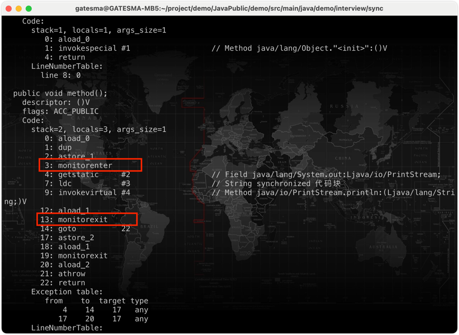
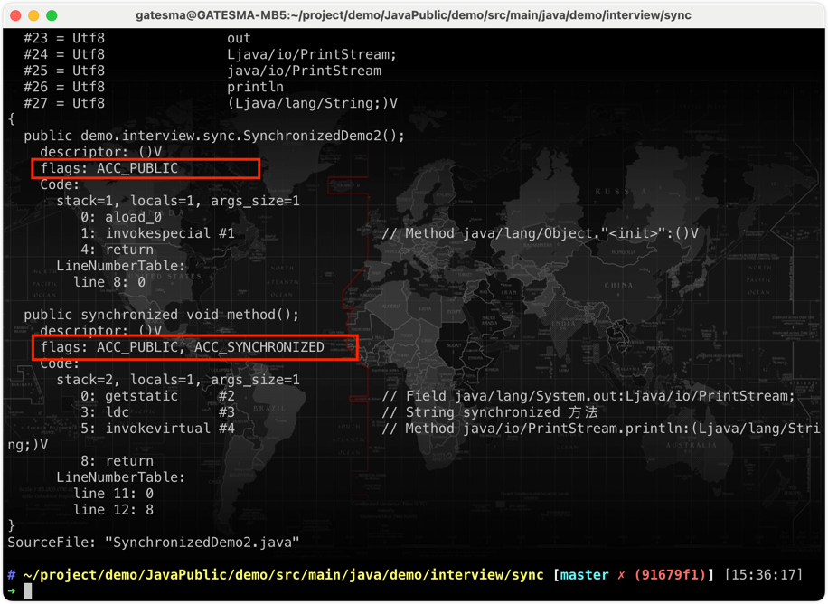
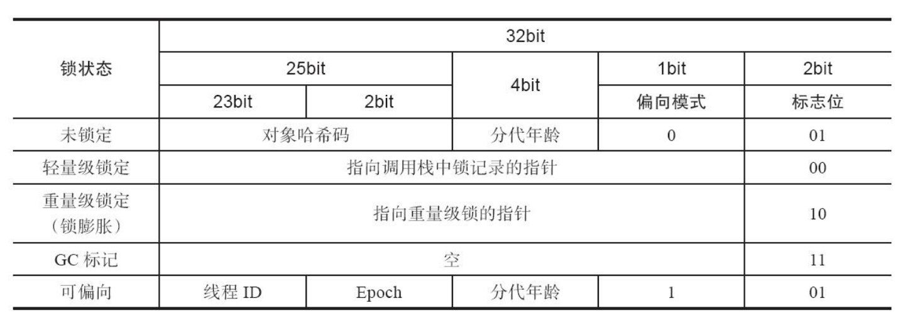

# Synchronized 详解

> synchronized 是 Java多线程中的一种锁，也是面试的高频考点

在Java中，synchronized锁可能是我们最早接触的锁了，在 JDK1.5 之前synchronized是一个重量级锁，相对于juc包中的Lock，synchronized显得比较笨重。 在 Java 6 之后 Java 官⽅对从 JVM 层⾯对synchronized进行⼤优化，所以现在的 synchronized 锁效率也还不错。

## 一、 synchronized 的使用

### 1. synchronized 的作用

synchronized 的作用有三个：

1. 原子性： **所谓原子性就是指一个操作或者多个操作，要么全部执行并且执行的过程不会被任何因素打断，要么就都不执行**。被synchronized修饰的类或对象的所有操作都是原子的，因为在执行操作之前必须先获得类或对象的锁，直到执行完才能释放。

2. 可见性： **可见性是指多个线程访问一个资源时，该资源的状态、值信息等对于其他线程都是可见的**。 synchronized和volatile都具有可见性，其中synchronized对一个类或对象加锁时，一个线程如果要访问该类或对象必须先获得它的锁，而这个锁的状态对于其他任何线程都是可见的，并且在释放锁之前会将对变量的修改刷新到共享内存当中，保证资源变量的可见性。

3. 有序性：有序性值程序执行的顺序按照代码先后执行。 synchronized和volatile都具有有序性，Java允许编译器和处理器对指令进行重排，但是指令重排并不会影响单线程的顺序，它影响的是多线程并发执行的顺序性。synchronized保证了每个时刻都只有一个线程访问同步代码块，也就确定了线程执行同步代码块是分先后顺序的，保证了有序性。

### 2. synchronized 的使用

synchronized 有三种使用方式：

1. 修饰实例方法：锁定当前对象。进入同步代码前要获得当前对象实例的锁。
2. 修饰静态方法：进入同步代码前要获得当前 class 的锁
3. 修饰代码块：指定加锁对象，对给定对象/类加锁。synchronized(this|object)表示进入同步代码库前要获得给定对象的锁。synchronized(类.class)表示进入同步代码前要获得当前class的锁。

## 二. 修饰方法和修饰代码块的实现原理

数据同步需要依赖锁，那锁的同步又依赖谁？synchronized给出的答案是在软件层面依赖JVM，而j.u.c.Lock给出的答案是在硬件层面依赖特殊的CPU指令。

### 1. 修饰代码块的实现原理

```java
public class SynchronizedDemo {

    public void method() {
        synchronized (this) {
            System.out.println("synchronized 代码块");
        }
    }

}
```

通过 JDK 自带的 javap 命令查看 SynchronizedDemo 类的相关字节码信息：首先切换到类的对应目录执行 `javac SynchronizedDemo.java` 命令生成编译后的 .class 文件，然后执行`javap -c -s -v -l SynchronizedDemo.class`




** `synchronized` 同步语句块的实现使用的是 `monitorenter` 和 `monitorexit` 指令，其中 `monitorenter` 指令指向同步代码块的开始位置， `monitorexit` 指令则指明同步代码块的结束位置。**

> - 当执行 monitorenter 指令时，线程试图获取锁也就是获取 对象监视器 monitor 的持有权。
> - 在 Java 虚拟机(HotSpot)中，Monitor 是基于 C++实现的，由ObjectMonitor实现的。每个对象中都内置了一个 ObjectMonitor对象。
另外，wait/notify等方法也依赖于monitor对象，这就是为什么只有在同步的块或者方法中才能调用wait/notify等方法，否则会抛出java.lang.IllegalMonitorStateException的异常的原因。
> - 在执行monitorenter时，会尝试获取对象的锁，如果锁的计数器为 0 则表示锁可以被获取，获取后将锁计数器设为 1 也就是加 1。
> - 在执行 monitorexit 指令后，将锁计数器设为 0，表明锁被释放。如果获取对象锁失败，那当前线程就要阻塞等待，直到锁被另外一个线程释放为止。


### 2. 修饰方法的实现原理

```java
public class SynchronizedDemo2 {

    public synchronized void method() {
        System.out.println("synchronized 方法");
    }

}
```

反编译一下：



**`synchronized` 修饰的方法并没有 `monitorenter` 指令和 `monitorexit` 指令，取得代之的是在方法上有一个 `ACC_SYNCHRONIZED` 标识，该标识指明了该方法是一个同步方法。JVM 通过该 `ACC_SYNCHRONIZED` 访问标志来辨别一个方法是否声明为同步方法，从而执行相应的同步调用。**


### 3. 总结

- synchronized 同步语句块的实现使用的是 monitorenter 和 monitorexit 指令
- synchronized 修饰的方法使用 ACC_SYNCHRONIZED 标识该方法是一个同步方法
- 无论是同步方法还是同步代码块，无论是ACC_SYNCHRONIZED还是monitorenter、monitorexit都是基于`Monitor`实现的


## 三、synchronized 同步概念

### 1. Java 对象头

这一部分在 JVM 的实现里有详细的介绍。Java对象头就是每一个Java对象都有一个固定的头部，32位，4个字节（目前也有64位）。称为对象的Mark word。

在不同的锁状态下，Mark word会存储不同的信息，这也是为了节约内存常用的设计
- 存储自身的运行时数据：哈希码（HashCode）、GC分代年龄（Generational GC Age） 、锁标志相关信息等。
- 另外一部分用于存储指向方法区对象类型数据的指针，如果是数组对象，还会有一个额外的部分用于存储数组长度。



### 2. 监视器（Monitor）

任何一个对象都有一个Monitor与之关联，当且一个Monitor被持有后，它将处于锁定状态。Synchronized在JVM里的实现都是基于进入和退出Monitor对象来实现方法同步和代码块同步，虽然具体实现细节不一样，但是都可以通过成对的MonitorEnter和MonitorExit指令来实现。

与一切皆对象一样，所有的Java对象是天生的Monitor，每一个Java对象都有成为Monitor的潜质，因为在Java的设计中 ，每一个Java对象自打娘胎里出来就带了一把看不见的锁，它叫做内部锁或者Monitor锁。

也就是通常说Synchronized的对象锁，MarkWord锁标识位为10，其中指针指向的是Monitor对象的起始地址。在Java虚拟机（HotSpot）中，Monitor是由ObjectMonitor实现的。


### 3. 总结

**除了重量级锁，其它的状态基本都是只通过锁对象的Mark Word以及CAS来帮助实现的，提升了效率。而重量级锁会利用ObjectMoniter对象去与OS层面的mutex信号量做映射，线程切换的时候也会造成更多的消耗（详细见后文）。**
 
* 只有jdk1.6之前，使用sychronized加锁的时候，才会直接调用ObjectMonitor的enter和exit，这种锁被称之为重量级锁
  > Java的线程是映射到操作系统原生线程之上的，如果要阻塞或唤醒一个线程就需要操作系统的帮忙，这就要从用户态转换到核心态，因此状态转换需要花费很多的处理器时间，对于代码简单的同步块（如被synchronized修饰的get 或set方法）状态转换消耗的时间有可能比用户代码执行的时间还要长，所以说synchronized是java语言中一个重量级的操纵。

* 在JDK1.6中出现对锁进行了很多的优化，进而出现轻量级锁，偏向锁，锁消除，适应性自旋锁，锁粗化，这些操作都是为了在线程之间更高效的共享数据 ，解决竞争问题


> 关于monitor对象，之后再详细了解


## 四、synchronized 锁优化

从JDK5引入了现代操作系统新增加的CAS原子操作（ JDK5中并没有对synchronized关键字做优化，而是体现在J.U.C中，所以在该版本concurrent包有更好的性能 ），从JDK6开始，就对synchronized的实现机制进行了较大调整，包括使用JDK5引进的CAS自旋之外，还增加了自适应的CAS自旋、锁消除、锁粗化、偏向锁、轻量级锁这些优化策略。由于此关键字的优化使得性能极大提高，同时语义清晰、操作简单、无需手动关闭，所以推荐在允许的情况下尽量使用此关键字，同时在性能上此关键字还有优化的空间。

锁主要存在四种状态，依次是：无锁状态、偏向锁状态、轻量级锁状态、重量级锁状态，锁可以从偏向锁升级到轻量级锁，再升级的重量级锁。但是锁的升级是单向的，也就是说只能从低到高升级，不会出现锁的降级。


### 1. 偏向锁

偏向锁是JDK6中的重要引进，因为HotSpot作者经过研究实践发现，在大多数情况下，锁不仅不存在多线程竞争，而且总是由同一线程多次获得，为了让线程获得锁的代价更低，引进了偏向锁。

当一个线程访问同步块并获取锁时，会在对象头和栈帧中的锁记录里存储锁偏向的线程ID，以后该线程在进入和退出同步块时不需要进行CAS操作来加锁和解锁，只需简单地测试一下对象头的Mark Word里是否存储着指向当前线程的偏向锁。

如果测试成功，表示线程已经获得了锁。如果测试失败，则需要再测试一下Mark Word中偏向锁的标识是否设置成1（表示当前是偏向锁）：如果没有设置，则使用CAS竞争锁；如果设置了，则尝试使用CAS将对象头的偏向锁指向当前线程。

偏向锁使用了一种等到竞争出现才释放锁的机制（**偏向锁是乐观锁**），所以当其他线程尝试竞争偏向锁时， 持有偏向锁的线程才会释放锁。

### 2. 轻量级锁

> 自旋锁：如果物理机器有一个以上的处理器或者处理器核心，能让两个或以上的线程同时并行执行，我们就可以让后面请求锁的那个线程“稍等一会”，但不放弃处理器的执行时间，看看持有锁的线程是否很快就会释放锁。为了让线程等待，我们只须让线程执行一个忙循环（自旋），这项技术就是所谓的自旋锁。

引入轻量级锁的主要目的是 在没有多线程竞争的前提下，减少传统的重量级锁使用操作系统互斥量产生的性能消耗。当关闭偏向锁功能或者多个线程竞争偏向锁导致偏向锁升级为轻量级锁，则会尝试获取轻量级锁。

（1）轻量级锁加锁

线程在执行同步块之前，JVM会先在当前线程的栈桢中创建用于存储锁记录的空间，并将对象头中的Mark Word复制到锁记录中，官方称为Displaced Mark Word。然后线程尝试使用CAS将对象头中的Mark Word替换为指向锁记录的指针。如果成功，当前线程获得锁，如果失败，表示其他线程竞争锁，当前线程便尝试使用自旋来获取锁。

（2）轻量级锁解锁

轻量级解锁时，会使用原子的CAS操作将Displaced Mark Word替换回到对象头，如果成功，则表示没有竞争发生。如果失败，表示当前锁存在竞争，锁就会膨胀成重量级锁。


因为自旋会消耗CPU，为了避免无用的自旋（比如获得锁的线程被阻塞住了），一旦锁升级成重量级锁，就不会再恢复到轻量级锁状态。当锁处于这个状态下，其他线程试图获取锁时， 都会被阻塞住，当持有锁的线程释放锁之后会唤醒这些线程，被唤醒的线程就会进行新一轮的夺锁之争。

### 3. 重量级锁

重量级锁就是用monitor对象来实现的加锁。对象头中标志位位10，存储指向monitor对象的指针


### 4. 总结

- 无锁：最开始一个对象是无锁的状态，标志位01
- 偏向锁：一个线程可以先尝试竞争偏向锁，将线程ID写入Mark Word
- 轻量级锁：这时当另一个线程尝试给对象加锁时，将升级为轻量级锁。另一个线程将采用自旋CAS修改Mark Word为指向锁记录的指针
- 重量级锁：轻量级解锁时，会使用原子的CAS操作将Displaced Mark Word替换回到对象头，如果成功，则表示没有竞争发生。如果失败表示当前锁存在竞争，锁就会膨胀成重量级锁（换一种说法：**当多线程不能交替获得轻量级锁而不产生竞争（可以自旋等待）时，轻量级锁升级为重量级锁**）


各种锁并不是相互代替的，而是在不同场景下的不同选择，绝对不是说重量级锁就是不合适的。每种锁是只能升级，不能降级，即由偏向锁->轻量级锁->重量级锁，而这个过程就是开销逐渐加大的过程。

> - 如果是单线程使用，那偏向锁毫无疑问代价最小，并且它就能解决问题，连CAS都不用做，仅仅在内存中比较下对象头就可以了
> - 如果出现了其他线程竞争，则偏向锁就会升级为轻量级锁
> - 如果其他线程通过一定次数的CAS尝试没有成功，则进入重量级锁


## 参考

* http://www.hollischuang.com/archives/1883
* http://47.103.216.138/archives/2030
* https://blog.csdn.net/qq_53578500/article/details/126073402
* https://blog.51cto.com/u_15127702/4012095


