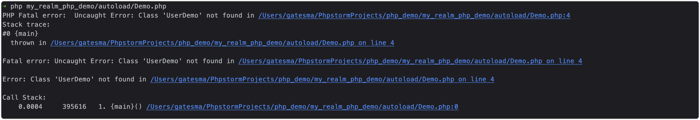

# Composer 自动加载

> 团队有个老项目还在使用php。曾经说php是世界上最好的语言，现在php在追求高并发量的时代已经没落了。
> 但最近在学习过程中，还是发现了php的一些优点，世界上最好的语言并不是空穴来风。
> 比如php写接口的透传简直太方便，java要写一个600个字段的透传，要被累死，而且扩展性极差。。。php的弱类型语言开发起来确实太舒服了

## 一、什么是自动加载、为什么会有自动加载

考虑下面这种简单的情况：

我有一个UserDemo的php文件，有一个UserDemo类
```php
// UserDemo.php
<?php


class UserDemo
{
    private $name;
    private $age;

    public function __construct($name, $age)
    {
        $this->name = $name;
        $this->age = $age;
    }

    public function getInfo() {
        return 'My name is ' . $this->name . ', age: ' . $this->age;
    }
}

```
我在另一个Demo类里希望使用这个UserDemo类：
```php
// Demo.php
<?php

$user = new UserDemo('gates', 22);
echo $user->getInfo();
```

执行这个php脚本发现是报错的，提示 PHP Fatal error:  Uncaught Error: Class 'UserDemo' not found。这是因为PHP里所有外部文件都需要使用include和require方法，去把定义这个Class的文件包含进来


加载文件类似于Java中的import。
在php里需要include和require外部php文件，这个在小规模开发的时候，没什么大问题。但在大型的开发项目中，使用这种方式会带来一些隐含的问题：如果一个PHP文件需要使用很多其它类，那么就需要很多的require/include语句，
这样有可能会造成遗漏或者包含进不必要的类文件。如果大量的文件都需要使用其它的类，那么光require就已经是一个噩梦了。


### 二、PHP自动加载函数__autoload()

是一个魔法方法。如果发现这个类没有加载，就会自动运行__autoload()函数，在函数内部我们可以自定义加载php文件
```php
<?php

function __autoload($classname)
{
    require_once ($classname . ".class.php");
}
```

虽然这个函数解决了大量require文件的问题，但依旧不完美：

如果在一个系统的实现中，需要使用很多其它的类库，这些类库可能是由不同的开发人员编写的，其类名与实际的磁盘文件的映射规则不尽相同。这时如果要实现类库文件的自动加载，就必须在__autoload()函数中将所有的映射规则全部实现。
会导致__autoload()函数十分臃肿，这时即便能够实现，也会给将来的维护和系统效率带来很大的负面影响。


### 三、SPL Autoload

SPL是Standard PHP Library（标准PHP库）的缩写。它是PHP5引入的一个扩展库，其主要功能包括autoload机制的实现及包括各种Iterator接口或类。SPL Autoload具体有几个函数：

1. spl_autoload_register：注册__autoload()函数
2. spl_autoload_unregister：注销已注册的函数
3. spl_autoload_functions：返回所有已注册的函数
4. spl_autoload_call：尝试所有已注册的函数来加载类
5. spl_autoload：__autoload()的默认实现
6. spl_autoload_extionsions：注册并返回spl_autoload函数使用的默认文件扩展名。

简单来说，spl_autoload就是SPL自己定义的__autoload()函数，功能很简单，就是去注册的目录（由set_include_path设置）找与$classname同名的.php/.inc文件。当然，你也可以指定特定类型的文件，方法是注册扩展名(spl_autoload_extionsions)。

而splautoload_register()就是我们上面所说的__autoload调用堆栈，我们可以向这个函数注册多个我们自己的__autoload()函数，当PHP找不到类名时，PHP就会调用这个堆栈，一个一个去调用自定义的__autoload()函数，实现自动加载功能。如果我们不向这个函数输入任何参数，那么就会注册spl_autoload()函数。


PSR标准中，PSR-0、PSR-4都是自动加载相关的标。[PSR规范](psr.md)

### 四、Composer 自动加载

有了 SPL 自动加载之后，其实还是很麻烦，因为我们还是要写代码，能不能再优化一些呢，程序员都是很懒的，能不能就是我们只需要简单的在配置文件里配置一下，这个自动加载就全部搞定了？

可以，composer就帮助我们干了这个事情，[了解Composer是什么](composer.md)。Composer是php的包管理工具，基本上所有大型php项目都需要用composer管理，
用composer来帮助我们完成自动加载非常合适。


composer支持的几种加载方式：

#### 1. PSR-4（推荐）

在composer.json里是这样进行配置PSR-4自动加载：
```json
{
  "autoload": {
    "psr-4": {
      "app\\": "src/"
    }
  }
}
```

这个配置完成的效果是：

假设项目中有一个类“User”，对应的命名空间为“/app/User.php”，那么你就可以用 "/src/User.php" 来引入这个类

#### 2. PSR-0（不推荐）

配置：
```json
{
  "autoload": {
    "psr-0": {
      "app\\": "src/"
    }
  }
}
```

这样配置的效果是：

当试图加载new app/User这个class时，composer会去寻找 "src/app/User.php" 这个文件，如果它存在则进行加载。

#### 3. Class-map方式

```json
{
  "autoload": {
    "classmap": ["src/", "lib/", "Something.php"]
  }
}
```
效果：这些目录下的所有php文件都会被加载

composer会扫描指定目录下以.php 或.inc 结尾的文件中的 class，生成 class 到指定 file path 的映射，并加入新生成的vendor/composer/autoload_classmap.php 文件中。

#### 4. Files方式

```json
{
  "autoload": {
    "files": ["src/MyLibrary/functions.php"]
  }
}
```

这个不解释了，就是引入单个文件


---

一般情况下，我们使用 PSR-4 来加载的情况是最多的。Composer 通过配置来加载类，原理其实也是用的 SPL Autoload。
**注意：每次修改composer.json文件之后需要重新执行composer install更新**


Composer自动加载所用到的源文件（在vendor/composer文件夹下）：

- autoload_real.php: 自动加载功能的引导类。
    任务是composer加载类的初始化 (顶级命名空间与文件路径映射初始化) 和注册(spl_autoload_register())
- ClassLoader.php: composer加载类。
    composer自动加载功能的核心类
- autoload_static.php: 顶级命名空间初始化类，
    用于给核心类初始化顶级命名空间
- autoload_classmap.php: 自动加载的最简单形式，
    有完整的命名空间和文件目录的映射
- autoload_files.php: 用于加载全局函数的文件，
    存放各个全局函数所在的文件路径名
- autoload_namespaces.php: 符合PSR0标准的自动加载文件，
    存放着顶级命名空间与文件的映射
- autoload_psr4.php: 符合PSR4标准的自动加载文件，
    存放着顶级命名空间与文件的映射


## 五、参考
- https://learnku.com/articles/62233
- https://juejin.cn/post/6844904180851671054
- https://www.getyii.com/topic/697
- https://www.daijulong.com/course/composer/autoload-classmap.html
- https://chebincarl.github.io/2020/05/19/PHP-Composer%E8%87%AA%E5%8A%A8%E5%8A%A0%E8%BD%BD/