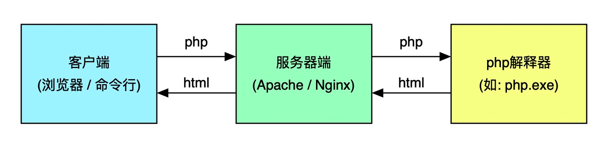

## PHP 是什么以及运行原理


### php 是什么
> PHP(Hypertext Preprocessor 超文本预处理器) 的简称，是一种被广泛应用的开源通用的服务器端脚本语言，适用于 Web 开发并可嵌入 HTML 中。


- 通用：指跨平台，如：Windows、Linux、MacOS
- 开源：意味着你可以轻松获取全部源代码，并进行定制或扩展
- 免费：意味着你不必为 PHP 花一分钱，哪怕用在商业项目中
- 服务器端：意味着你必须将它安装在服务器环境下才可以使用
- 脚本语言：解释型语言，按编写顺序执行。是指不需要编译,直接由解释器/虚拟机执行的编程语言
- **php 是运行在服务端的弱类型脚本语言，支持跟 html 代码混编**


### php 程序执行流程




## PHP 数据类型

### 1. php 标量类型

| 类型       | 	描述 |
|---|---|
| 布尔型 Boolean |	true 和 false|
| 整型 Integer |	负数 - 0 - 无限大|
| 浮点型 Float|	带小数的数字（负数 - 0 - 无限大）|
| 字符串 String|	汉字、英文、符号、其它国家语言|


### 2. php 复合类型

| 类型	 | 描述  |
|-----|-----|
|array|	数组|
|object|	对象|


callable 可调用

iterable 可迭代


#### 数组

数组循环


foreach
```php
foreach( $arr as $v ){
    echo $v;
}


foreach( $arr as $k=>$v ){
    foreach ($v as $key => $value) {
        echo $value;
    }
}
```

#### 对象


### 3. php 特殊类型


|类型	|描述|
|-|-|
|空值 NULL	|表示变量没有值|
|resource   | 资源 |


## PHP 函数


### 基本

- 函数是全局成员 不受作用域限制。
- php函数的作用：完成特定功能的代码块，封装成函数可以实现复用性，提高代码的可维护性。
- php内置了上千种函数可供我们直接调用，函数库文件已经编译到我们所使用的发行版中了，可以直接指定函数名称来调用，当然我们也可以自定义函数来完成特定功能。
- 函数的命名规则基本和变量的命名规则一直，可以以字母或下划线开头，后跟字母数字或下划线，但不能以数字开头，函数不区分大小写。
- 函数有三大要素 参数，返回值，函数体
- 同一个脚本不能存在同名函数
- 接口开发 函数返回值会转为通用的json格式的数据返回，这样以来就可以和其他的编程语言进行数据交互，例如js与java php  python


### 匿名函数/闭包

- 全局变量是指声明在函数外部的变量，在函数内部访问不到。 **使用 $GLOBALS['name'] 或者 global 解决**
- 局部变量是指声明在函数内部的变量，只能在函数内部被访问到。
- 匿名函数(闭包):通常会被当做回调函数的参数来使用。
```php
// 匿名函数 :通常会被当做回调函数的参数来使用。
$closure = function ($name) {
    return "name: {$name}";
};
echo $closure('爆龙战士');
```

- 闭包里使用全局变量时，需要**使用 global 或者 $GLOBALS['name'] 或者 在匿名函数上 use ($name, $email)**
```php
$name = '爆龙战士';
$email = 'gatesma@foxmail.com';
$c = function ($modify) use ($email) {
    global $name;
    // $GLOBALS['name'] 也可以
    return "{$modify}{$name}您好，恭喜您邮箱注册成功，账号为{$email}";
};
```

- 闭包改变变量上下文的值 需要引用传递
```php
// 闭包改变变量上下文的值 需要引用传递
$c1 = function ($newName) use (&$name) {
    $name = $newName;
};
$c1('西门老师');
echo $name; //全局变量的值被改变~
```

### 回调函数

- 回调函数：php回调是指在主线程函数执行的过程中,突然跳去执行设置的回调函数,回调函数执行结束后, 再回到主线程处理接下来的流程
- 匿名函数最通常作为回调函数的参数使用
- php脚本是单线程，脚本是同步执行的，如果遇到耗时函数将会发生线程阻塞的问题，应该将它改为异步回调的方式执行

- call_user_func_array 和 call_user_func 可以用来手动执行函数

```php
function sayHello(string $name): string //返回string类型
{
    return "{$name},欢迎您";
}

var_dump(sayHello('爆龙战士'));

var_dump(call_user_func_array('sayHello', ['爆龙战士']));

var_dump(call_user_func('sayHello', '爆龙战士'));

// 这样也可以？？
$hello = "sayHello";
var_dump($hello('爆龙战士'));
```

## 面向对象

### 一、面向对象的概念

**1.1  什么是面向对象(object oriented)**
- 世间万物皆对象，抽象的也是对象，一切可见或不可见都是对象,面向对象是一种以对象为基础的编程思想(自下而上)
- 面向过程是一种以过程为中心的编程思想:分析出解决问题所需要的步骤，然后用函数把这些步骤一步一步实现(自上而下)


**1.2 对象的基本组成**

- 对象的组成元素:是对象的数据模型，用于描述对象的数据,又称为对象的**属性**，或者对象的**成员变量**.
- 对象的行为: 是对象的**行为模型**，用于描述对象能够做什么事情,又被称为对象的**成员方法**.

**1.3 对象特点**
- 每一个对象都是独一无二的
- 对象是一个特定的事物，他的职能是完成特定功能
- 对象是可以重复使用

**1.4 面向对象简介**
- 面向对象编程就是编程的时候数据结构（数据组织方式 ）都通过对象的结构进行存储，使用**属性**和**方法**组织起来

**1.5 面向对象的实质**
-面向对象就是把生活中要解决的问题都用对象的方式进行存储--把所有的数据用属性、方法表现出来。对象之间的互动是通过**方法的调用**完成**互动**


### 二、面向对象的基本实践
**2.1 类的概念**
- 物以类聚，把具有相似特性的对象对垒到一个类中,类定义了这些相似对象拥有的相同的属性和方法
- 类是相似对象的描述，成为类的定义，是该类对象的蓝图或者原型
- 类的对象称为一个类的实例(Instance)
- 类的属性和方法统称为类成员


- public private protected
  - 成员属性前要有访问修饰符 public private protected
  - public 默认的, 关键词定义类内、类外、子类都可见
  - protected 关键词定义类内、子类可见，类外不可见
  - private 关键词定义类内可见, 子类、类外不可见


**2.2 类的实例化**
- 类的实例化：通过类定义创建一个类的对象
- 类的定义属性值都是空或默认值，而对象的属性都有具体的值


- 构造器

```php
public function __construct($name, $height, $team, $num, $weight)
{
    // 类成员之间的互相访问  $this 本对象
    // 1.初始化类成员 让类/对象的状态稳定下来
    // 2.给对象的属性进行初始化赋值
    // 3.给私有或者受保护的成员属性赋值
    $this->name = $name;
    $this->height = $height;
    $this->team = $team;
    $this->num = $num;
    $this->weight = $weight;
}
```

- **魔术函数**
  - 魔术函数 : `__set`、 `__get`、 `__call`、 `__callStatic`
  - 构造函数 构造器 类每实例化一次 构造函数自动被调用


- **类的自动加载器**
  -  **如果需要引用的类文件过多，调用类的自动加载器**

```php
<?php
// spl_autoload_register(function ($className) {
//     //检查要加载的类
//     printf('类名：%s<br>', $className);

//     // 要加载的类文件所在的绝对路径

//     $file = __DIR__ . DIRECTORY_SEPARATOR . $className . '.php';
//     echo $file;

//     if (!(is_file($file) && file_exists($file))) {
//         throw new \Exception('文件名不合法或者文件不存在');
//     }

//     require $file;
// });


spl_autoload_register(function ($classname) {
    $file = __dir__ . DIRECTORY_SEPARATOR . 'vendor' . DIRECTORY_SEPARATOR . $classname . '.php';
    if (!(is_file($file) && file_exists($file))) {
        throw new \Exception('文件名不合法或者文件不存在');
    }

    require $file;
});

```


**2.3 类的定义**
- 类的定义以关键字class开始，后面跟着这个类的名称。类的命名通常每个单词的第一个字母大写，以中括号开始和结束
- 类的实例化为对象时使用关键字new，new之后紧跟类的名称和一对圆括号
- 对象中得成员属性和方法可以通过->符号来访问

### 三、面向对象的高级实战
**3.1 对象的继承**
`父类：拥有部分相同的属性和方法`
`继承的好处:`

- 父类里面定义的类成员可以不用在子类中重复定义，节约了编程的时间和代价;
- 同一个父类的子类拥有相同的父类定义的类成员，因此外部代码调用他们的时候可以一视同仁;
- 子类可以修改和调用父类定义的类成员我们称为重写（Overwrite）, 一旦子类修改了，就按照子类修改之后的功能执行;

`子类`：

- 子类可以通过$this访问父类的属性
- 子类的对象可以直接调用父类的方法和属性
- PHP的**单继承特性**：类不允许同时继承多个父类（**extends**后面只能跟一个父类名称）


- oop 继承  多态  封装（访问修饰符 public protected private finial）
- trait: 理解为一个公共方法集
  - 对于类的公共方法，使用extends继承父类太重了，可以用" trait"实现它 
  - trait 借用了class语法实现的一个轻量级的"类",但不是类,所以不能"实例化"
  - 在要使用trait的类中,使用use关键字引用它即可
  - 如果子类, trait, 父类中存在同名成员方法, 优先级: 子类>trait>父类


**3.2 访问控制**
`面向对象的三种访问权限：`

- public是公有的类成员，可以在任何地方被访问,可以被类以及子类或者对象都可以访问;
- protected受保护的类成员，可以被其自身以及继承的子类访问,可以被子类继承，但是不能被对象访问，只能通过封装的方式让对象访问;
- private私有的类成员，只能被自身访问.不能被子类继承，也不能被对象访问，只能在自身通过封装让外界访问（例如在类里面定义一个公开方法来调用私有属性）;

**3.3 Static(静态)关键字**
`静态成员：定义时在访问控制关键字后添加static关键字即可（访问控制关键字：public. protected. private）`

- 静态属性用于保存类的公有数据，可以在不同对象间共享
- 静态方法里面只能访问静态属性
- 静态成员不需要实例化对象就可以访问
- 类的内部可以通过 self:: 或 static:: 关键字访问自身静态成员，self::$属性 self::方法()
- 通过 **parent::** 关键字访问父类的静态成员，也可以通过子类::父类静态成员
- **通过 类名:: 的方式在类的外部访问静态成员**

**3.4 重写和Final关键字**
- 子类中编写跟父类完全一致的方法可以完成对父类方法的重写，方法参数最好有默认参数
- 对于不想被任何类继承的类可以在class之前添加final关键字
- 对于不想被子类重写（overwrite, 修改）的方法，可以在方法定义前面添加final关键字

**3.5 数据访问**
- parent关键字可以可用于调用父类中被子类重写了的方法
- self关键字可以用于访问类自身的成员方法，静态成员和类常量；不能用于访问类自身的属性！！！使用常量的时候不需要在常量const名称前面添加$符号
- static::关键字用于访问类自身定义的静态成员，访问静态属性时需要在属性前面添加$符号。
- 常量属性const不能使用对象访问，仅能使用类访问，在类本体内可以使用“self::常量名”，在类本体外可以使用“类名::常量名”

**3.6 对象接口**
`接口就是把不同类的共同行为进行定义，然后在不同的类里面实现不同的功能`

- **interface**定义接口，**implements**用于表示类实现某个接口
- 接口里面的方法没有具体的实现，无**{}**
- 实现了某个接口的类必须提供接口中定义的方法的具体实现
- 不能实例化接口，但是能够判断某个对象是否实现了某个接口。**instanceof**关键字判断某个对象是否实现了某个接口 $object instanceof interface
- 接口可以继承接口（**interface extends interface**）
- 接口中定义的所有方法都**必须是公有**，这是接口的特性

**3.7 多态**
`因为接口的方法实现可以有很多，所以对于接口里面定义的方法的具体实现是多种多样的，这种特性我们称为多态`

`不需要知道对象属于哪个类，只要判断该对象的类是否实现接口，就能实现调用，相同代码实现不同结果`

`形象点说就是同一个接口，不同的对象实现，得出的结果不一样就是多态，如传入的是人类对象，得到的是人类吃苹果，传入的是猴子对象，得到的就是猴子吃香蕉。相同的一行代码，对于传入不同的接口的实现的对象的时候，表现是不同的。`


**3.8 抽象类**
`接口里面的方法都是没有实现的，而类里面的方法都是有实现的. 有没有一种形态，允许类里面一部分方法不实现呢？`

- 当接口中的某些方法对于所有的实现类都是一样的实现方法，只有部分方法需要用到多态的特性

- 如人和动物吃东西是不同的，但是呼吸是相同的，不需要为人和动物分别实现呼吸的功能
- abstract关键字用于定义抽象类
- 在抽象方法前面添加abstract关键字可以标明这个方法是抽象方法不需要具体实现{}
- 抽象类中可以包含普通的方法，有方法的具体实现
- 继承抽象类的关键字是extends
- 继承抽象类的子类需要实现抽象类中定义的抽象方法
- 抽象类不能被实例化，当子类继承抽象类的时候，所有的抽象的方法都必须定义


**后期静态绑定**

- 在创建类层次结构时，self关键字在编译时就已经确定了它的作用范围，而不是在运行时（后期），self不能动态地与调用类进行绑定。
- 解决办法：用static替换self进行后期（延迟）静态绑定。
- $this能动态地与调用类进行绑定。

```php
/**
 * 在创建类层次结构时，self关键字在编译时就已经确定了它的作用范围，而不是在运行时（后期），self不能动态地与调用类进行绑定。解决办法：用static替换self进行后期（延迟）静态绑定。
 * 
 * 
 * $this能动态地与调用类进行绑定。
 */

class Employee
{
    public static $favSport = 'football';
    public static function watchTv()
    {
        // echo 'watching ' . self::$favSport . '<br>';
        echo 'watching ' . static::$favSport . '<br>';
    }
}

class Execute extends Employee
{
    public static $favSport = 'Polo';
}


echo Execute::watchTv(); //watching football
```


**单例模式**

```php
// 单例模式 只允许类被实例化一次
class Father
{
    // 私有
    private function __construct()
    {
    }

    // 私有 
    private function __clone()
    {
    }

    // 存储father类的实例
    protected static $_instance;

    // 获取father类的实例 唯一实例
    static function getInstance()
    {
        if (static::$_instance === null) {

            //获取类的实例  
            //1. self 始终永远和当前类进行绑定
            //2. self 在静态继承上下文中, 不能动态的识别或者设置静态成员的调用者
            static::$_instance = new static;
        }
        // 返回对象
        return static::$_instance;
    }
}
```


### 四、PHP面向对象的特殊实践
#### 4.1 魔术方法之_toString()和invoke()
- `__toString`()当对象被当作String使用时，这个方法会被自动调用（需要在类中定义`__tostring`()方法。调用 echo $object
- `__invoke`()当对象被当作方法调用时，这个方法会被自动调用（需要在类中定义`__invoke`()方法）。调用 $object($parameter)

#### 4.2 魔术方法之__call()和__callStatic()
` `__call`()方法：当对象访问不存在的方法名称时，此方法自动调用。`

- 调用示例：public function `__call`($name,$argument){}
  **注意：访问控制关键字必须为public；必须有两个参数：对象访问的方法名称($name)、方法包含的参数($argument ==> 自动转换成数组)。**

`__callStatic`()方法：当对象访问不存在的静态方法名称时，此方法自动调用。

- 调用示例：public static function __callStatic($name,$argument){}
  **注意：同__call()；此方法为静态方法(static)。**


`这两种方法也被称为方法的重载（overloading）`

- 注意区分重写（overwrite）
- 通过这两个方法，同一个方法的调用可以对应不同的方法的实现（同一个方法的静态调用、动态调用对应不同的方法实现）

```php
<?php

/**
 * php重载  overload
 * php重载 属性，  是指动态地创建类属性和方法。我们是通过魔术方法（magic methods）来实现的。 `__get` `__set``__callStatic` `__call` 
 */
// 当访问类中不存在或者不可见的类成员时，会自动调用魔术方法`__set``__get`
// 因为魔术方法都是公开的，所以一些私有成员的不可见性就不会生效

class Credit
{
    public $name;
    private $idNum;
    public function __construct($name, $idNum)
    {
        $this->name = $name;
        $this->idNum = $idNum;
    }

    public function __set$name, $value)
    {
        $this->$name = $value;

        return $this->$name;
    }


    public function __get($name)
    {
        return $this->$name;
    }
}

$c = new Credit('胡歌', '341621198501215484');
$c->age = 20; //`__set`echo $c->age; //`__get`

echo $c->idNum;
```


* php重载 属性，  是指动态地创建类属性和方法。我们是通过魔术方法（magic methods）来实现的。 `__get` `__set` `__callStatic` `__call`
* 即时不实现 `__set` `__get` 方法，也可以成功设置和访问不存在的属性。但是不能设置和访问私有属性 private
* 访问不存在的属性或者私有属性的时候才会调用 `__get` `__set`。如果提前使用 $c->age = 20; 设置了一个属性，那么 echo $c->age; 不会走`__get`方法
* 方法拦截器 当访问当前类中不存在的方法时或者不可见的方法时 会调用魔术方法 `__call`   `__callStatic`


### 总结

- class: 类声明
- new: 类实例化
- public: 公开成员,随处可见
- protected: 受保护成员,仅在当前类或子类中可见
- private: 私有成员, 仅在当前类可见
- spl_autoload_register(): 自动加载器
- extends: 类的扩展
- static: 声明类的静态成员
- $this: 实例引用
- self: 类的引用
- trait: 类功能横向扩展


## 文件上传

### 1. php 关于文件上传的配置

> 文件上传项目项在`php.ini`中设置,常用的配置项有:

| 序号 | 配置项                | 默认值 | 描述                                          |
| ---- | --------------------- | ------ | --------------------------------------------- |
| 1    | `file_uploads`        | `On`   | 使 PHP 支持文件上传                           |
| 2    | `upload_tmp_dir`      | `/tmp` | 设置上传文件的暂存区位置        |
| 3    | `max_file_uploads`    | `20`   | 单次请求时允许上传的最大文件数量              |
| 4    | `max_execution_time`  | `30`   | 设置脚本被解析器终止之前PHP最长执行时间(秒) ,防止服务器资源被耗尽                    |
| 5    | `max_input_time`      | `60`   | 设置 PHP 通过 POST/GET/PUT 解析接收数据的时长(秒) |
| 6    | `memory_limit`        | `128M` | 设置脚本能够分配的最大内存容量 单位字节 1M等于1024K，一兆等于1048576字节     |
| 7    | `post_max_size`       | `8M`   | 设置通过 POST方法提交的数据量上限       |
| 8    | `upload_max_filesize` | `2M`  | 设置上传的单个文件的数据量上限    |
`memory_limit >= post_max_size  防止失控的脚本独占服务器内存，严重时使服务器崩溃`
`post_max_size > upload_max_filesize  因为后者只是限制通过file输入类型传递过来的数据量，不像post_max_size可以限制所有通过post方法上传的数据量上限`

### 2. `$_FILE`

- 上传文件的描述信息,全部保存在系统全局变量`$_FILES`中
- `$_FILES`以二维数组形式保存: `$_FILES['form_file_name']['key']`
- `'form_file_name'`: 对应着表单中`<input type="file" name="my_pic">`中`name`属性值
- `'key'`: 共有 5 个键名, 描述如下:

| 序号 | 键名       | 描述                                               |
| ---- | ---------- | -------------------------------------------------- |
| 1    | `name`     | 文件在客户端的原始文件名(即存在用户电脑上的文件名) |
| 2    | `type`     | 文件的 MIME 类型, 由浏览器提供, PHP 并不检查它     |
| 3    | `tmp_name` | 文件被上传到服务器上之后,在临时目录中显示的临时文件名    |
| 4    | `error`    | 和该文件上传相关的错误代码                         |
| 5    | `size`     | 已上传文件在客户端机器上的实际大小(单位为字节)                       |

- 文件上传错误信息描述

| 序号 | 常量                    | 值  | 描述                                       |
| ---- | ----------------------- | --- | ------------------------------------------ |
| 1    | `UPLOAD_ERR_OK`         | `0` | 没有错误发生,文件上传成功                  |
| 2    | `UPLOAD_ERR_INI_SIZE`   | `1` | 文件超过`php.ini`中`upload_max_filesize`值 |
| 3    | `UPLOAD_ERR_FORM_SIZE`  | `2` | 文件大小超过表单中`MAX_FILE_SIZE`指定的值  |
| 4    | `UPLOAD_ERR_PARTIAL`    | `3` | 文件只有部分被上传                         |
| 5    | `UPLOAD_ERR_NO_FILE`    | `4` | 没有文件被上传                             |
| 6    | `UPLOAD_ERR_NO_TMP_DIR` | `6` | 找不到临时文件夹                           |
| 7    | `UPLOAD_ERR_CANT_WRITE` | `7` | 文件写入失败                               |

### 3. `PHP文件上传函数`

- `系统中提供了多个文件处理函数，php还提供了两个专门来处理文件上传功能的函数`

| 序号 | 键名       | 描述                                               |
| ---- | ---------- | -------------------------------------------------- |
| 1    | `is_uploaded_file()`   | 用来检测文件是否是通过http post方法上传的，而不是系统上的一个文件。作用是防止潜在攻击者通过问题脚本访问并非用于交互的文件|
| 2    | `move_uploaded_file()` | 将上传的文件从临时目录移动到最终位置|


## MVC  (一种架构模式)
- M: Model(模型层),最bottom一层,是核心数据层,程序需要操作的数据或信息.
- V:View (视图层),最top一层,直接面向最终用户,视图层提供操作页面给用户,被誉为程序的外壳.
- C: Controller(控制层),是middile层, 它负责根据用户从"视图层"输入的指令，选取"数据层"中的数据，然后对其进行相应的操作，产生最终结果。

- 仿站: V - M - C
- 自主: M - V - C

### 设计模式

- 依赖注入
- 服务容器Container
- Facade
- 单例模式(把构造方法私有化)  防止重复实例化，避免大量的new操作，减少消耗系统和内存的资源，使得有且仅有一个实例对象


